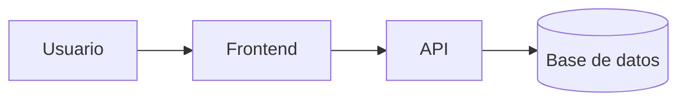

# App de Gestión de Biblioteca


Una aplicación web moderna para la gestión, préstamo y administración de libros en bibliotecas. Permite a los usuarios explorar el catálogo disponible y a los administradores gestionar los préstamos de forma eficiente.

## Tabla de contenidos

- [Descripción](#descripción)
- [Instalación](#instalación)
- [Estado de funcionalidades](#estado-de-funcionalidades)
- [Pendientes](#pendientes)
- [Arquitectura](#arquitectura)
- [Contribuidores](#contribuidores)

## Descripción

Este proyecto simula una plataforma integral de biblioteca donde los usuarios pueden registrarse, buscar libros por categoría y solicitar préstamos en línea.

## Instalación

```bash
# Clonar el repositorio
git clone [https://github.com/jhosepcruz-creator/laboratorio-readme.git](https://github.com/jhosepcruz-creator/laboratorio-readme.git)

# Entrar al directorio
cd laboratorio-readme

# Instalar dependencias
npm install
```
## Estado de funcionalidades

|Autenticación de usuario|Listo|
|------------------------|-----|
|Búsqueda de libros      |Listo|
|Sistema de préstamos    |En progreso|
|Reportes administrativos|Pendiente|

## Pendientes
- [x] Diseño de la base de datos
- [ ] Pruebas unitarias

## Arquitectura



## Contribuidores
- Jhosep Cruz - @jhosepcruz-creator